# Simple Text Search Engine Notebook

## Overview
This project is a Jupyter Notebook that demonstrates how to build a simple text search engine from scratch. The search engine works based on the content of the documents and incorporates user feedback to improve the relevance of search results over time. The notebook is designed to be educational and serves as a practical introduction to various concepts in Natural Language Processing (NLP) and Information Retrieval.

## Features

* `Tokenization and Stemming`: The notebook starts by tokenizing and stemming the document corpus to prepare it for vectorization.

* `TF-IDF Vectorization`: The Term Frequency-Inverse Document Frequency (TF-IDF) technique is used to convert the text data into numerical vectors.

* `Cosine Similarity`: This metric is used to measure the relevance of each document to a given query.

* `Feedback Mechanism`: The search engine learns from user feedback to improve the quality of search results.

* `Scorer Class`: All functionalities are encapsulated in a Scorer class, making the code modular and easy to manage.

* `Feature Weighting`: The notebook also explores how to fine-tune the search engine by adjusting the weights of different features.

## Tools for Easier Implementation

While the notebook provides a hands-on approach to building a text search engine, there are tools that can make the process even easier:

### [Stanza Toolkit](https://stanfordnlp.github.io/stanza/)
Stanza is a Python NLP library developed by the Stanford NLP Group. It offers pre-trained models for various NLP tasks like tokenization, part-of-speech tagging, and named entity recognition. Using Stanza can simplify the text preprocessing steps in the notebook.

### [TextBlob](https://textblob.readthedocs.io/en/dev/)
TextBlob is another Python library for processing textual data. It provides simple APIs for common NLP tasks such as noun phrase extraction, sentiment analysis, and translation. TextBlob could be used to extend the capabilities of the search engine, for example, by incorporating sentiment analysis into the scoring algorithm.

## How to Run the Notebook
* Clone the repository to your local machine.
* Install the required Python packages.
* Open the notebook using Jupyter Notebook or Jupyter Lab.
* Run the cells in the notebook to see the search engine in action.

## Conclusion
This notebook is your go-to guide for building a text search engine. Whether you're a beginner or an experienced coder, there's something here for everyone. 🌱➡️🌳 Feel free to contribute and make this project even better. Happy coding! 🎈👩‍💻👨‍💻
